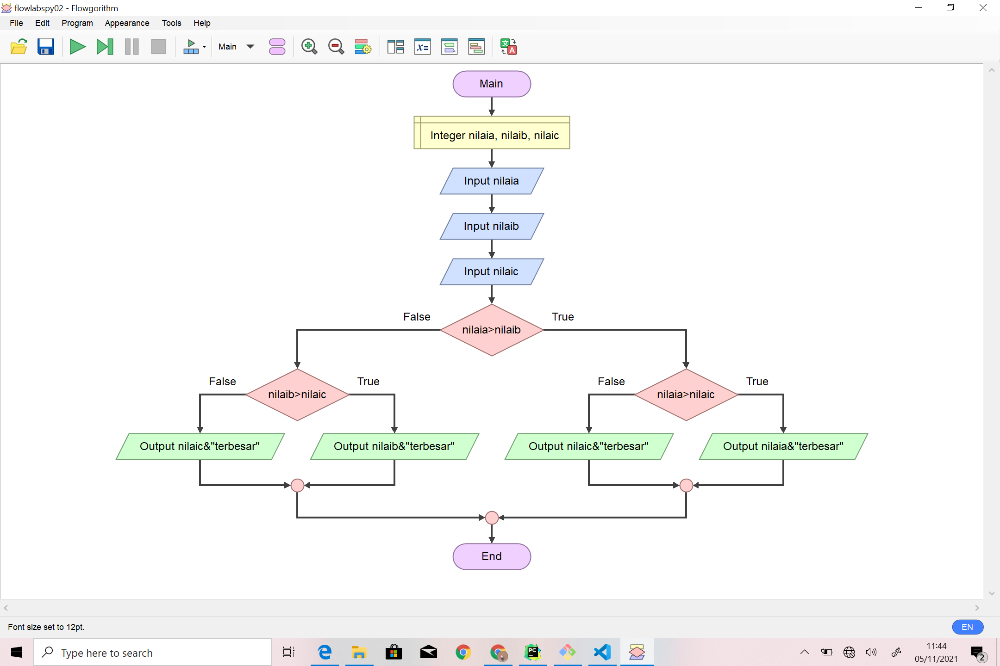
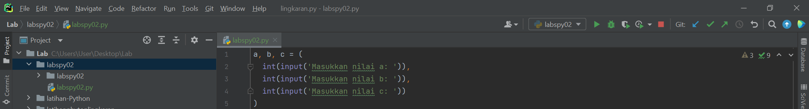
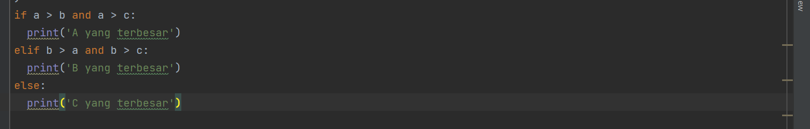
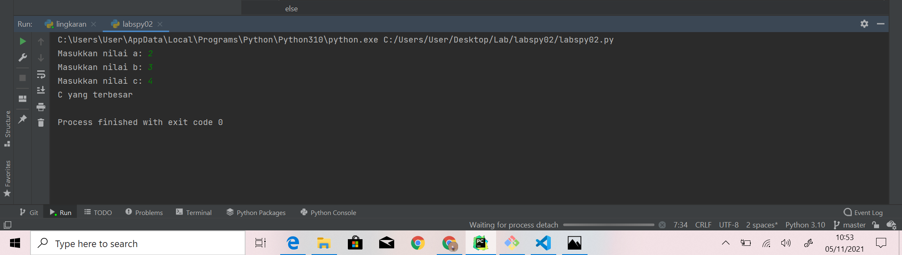
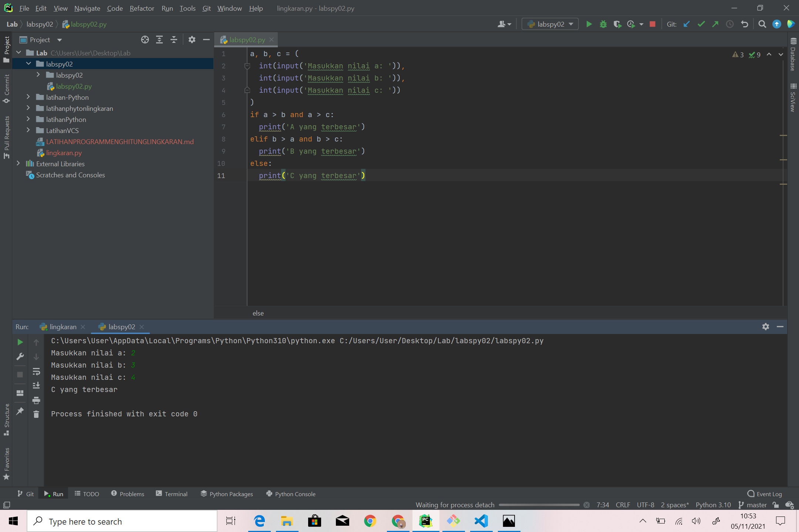

# Mencari Angka Terbesar Dari 3 Angka
berikut saya tampilkan flowchart dari program mencari angka terbesar

## Persiapan Variabel
kita mulai langsung dengan menyiapkan 3 buah variabel, yaitu a, b, dan c.
Ketiga variabel ini kita isi dari inputan user seperti berikut:

## Mencari Angka Terbesar Antara a, b, dan c
Langkah selanjutnya adalah menulis logika untuk mencari angka terbesar, apakah itu a? b? atau c?
Berikut ini kira-kira implementasi logikanya:

Sekarang coba kita testing, saya coba masukkan angka 2, 3, dan 4:

berikut saya tampilkan screenshot seluruh layar dari program

## sekian dan terima kasih ;)
